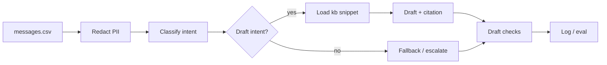

# Intelligent message routing with guardrails

Triage and route customer messages: PII redaction → intent classification → policy-grounded draft responses.

---

## Quick start (steps in order)

| Step | What | How to run |
|------|------|------------|
| 1 | Install dependencies | `make install` (or `uv sync`) |
| 2 | *(Optional)* Train MTL model | `make train` (writes `models/mtl_model.joblib`; run once for MTL classification) |
| 3 | *(Optional)* Enable LLM draft | Add `OPENAI_API_KEY` and `USE_LLM=1` to `.env` (see [LLM](#llm-gpt-4o-mini)) |
| 4 | Run the pipeline | `make run` (processes 5 messages: redact → classify → draft → checks) |
| 5 | Run tests | `make test` |
| 6 | Run evaluation | `make eval` (classification metrics + draft checks on data) |

Run `make` or `make help` to list all Makefile targets.

---

## Setup

- **Install dependencies** (UV):
  ```bash
  make install
  # or
  uv sync
  ```
  Or with pip: `pip install -e .` (see `pyproject.toml` for full dependency list).

- **Data**: Place or symlink data under `assignment/data/`:
  - `messages.csv` – message_id, text, label, sensitive, suggested_queue
  - `pii_patterns.yaml` – PII regex patterns
  - `kb/*.md` – policy snippets per intent

## Run

```bash
make run
# or
uv run python -m app
```

## Commands (all in Makefile)

All run-related commands are in the top-level `Makefile`. Run `make` or `make help` to list them.

| Command | Purpose |
|--------|--------|
| `make install` | Install dependencies (uv sync). Run first. |
| `make train` | Train MTL model; writes `models/mtl_model.joblib`. Run once before using MTL. |
| `make run` | Run pipeline (redact → classify → draft → check). Uses MTL if model exists. |
| `make test` | Run unit tests (pytest). |
| `make eval` | Run evaluation (classification metrics + draft checks). Override with `DATA_DIR=...` if needed. |

Environment: put `OPENAI_API_KEY` and `USE_LLM=1` in `.env` to enable LLM draft (see [LLM](#llm-gpt-4o-mini) below).

---

## What is implemented vs stubbed

- **PII redaction**: Implemented (YAML patterns, regex replace, unit tests).
- **Intent classification**: **Real MTL** in `app/mtl.py` (train with `make train`; shared TF-IDF + two LogisticRegression heads for intent and suggested_queue). Stub backend in `app/classify.py` when no model file. Pipeline and eval use MTL when `models/mtl_model.joblib` exists.
- **Draft response**: Implemented for ≥2 intents (card lost/stolen, suspected fraud) with policy citations; template-based output only (no placeholder text). Confidence-based escalation (threshold 0.7).
- **Guardrails**: Citation check and PII-in-draft check implemented; wired into pipeline.
- **Evaluation**: Classification accuracy (MTL or stub per model existence), draft checks on sample; redaction tests in test suite.
- **LLM draft**: Optional. Set `OPENAI_API_KEY` and `USE_LLM=1` to use **GPT-4o-mini** for draft generation; otherwise template is used. See [LLM (GPT-4o-mini)](#llm-gpt-4o-mini) below.

---

## LLM (GPT-4o-mini)

- **Enable**: Put your key in a `.env` file in the project root (or set env vars), then run:
  ```bash
  # .env (do not commit; already in .gitignore)
  OPENAI_API_KEY=sk-...
  USE_LLM=1
  ```
  ```bash
  make run
  ```
  The app loads `.env` automatically via python-dotenv. You can also `export OPENAI_API_KEY` and `export USE_LLM=1` instead.
- **Behaviour**: When `USE_LLM=1` and `OPENAI_API_KEY` is set, draft replies for supported intents (e.g. fraud, card lost/stolen) are generated by GPT-4o-mini with the policy snippet in context and a citation requirement. On missing key or API error, the pipeline falls back to the template draft.
- **Cost/latency**: GPT-4o-mini is low-cost and fast (~hundreds of ms per request). See [OpenAI pricing](https://openai.com/api/pricing/); input/output tokens are billed per 1M tokens.

## Assumptions, security, cost/latency

- **Data**: All inputs treated as confidential. No raw text is sent to any external API; **redaction runs before** any call to OpenAI (only redacted text is sent).
- **Cost/latency**: Stub/MTL classifier: negligible. LLM draft: per-request tokens; use GPT-4o-mini for low cost and latency.
- **Security**: PII patterns applied before any external call; no raw PII sent to OpenAI. Escalation path for low-confidence or failed draft checks.

---

## Trade-offs: ML vs LLM and hybrid

| Prefer | When |
|--------|------|
| **Traditional ML (e.g. MTL)** | High volume, strict latency/cost/data-residency, sufficient labelled data; need explainable features/weights. |
| **LLM (few-shot)** | Fast iteration, few labels, or open-ended drafting; acceptable to redact first and use local or managed API. |
| **Hybrid (LLM orchestrator + MTL)** | LLM handles redaction policy, tool calls, and drafting; MTL does classification for accuracy and cost; LLM invokes MTL as a tool. |

See `openspec/changes/intelligent-message-routing-guardrails/proposal.md` for the full comparison table (accuracy, latency, cost, security, sensitive data, explainability).

---

## Explainability and risk

- **Explainability**: Stub returns label/queue from ground truth; for MTL we would surface features or shared representations; for LLM we would surface rationales/citations (with guardrails).
- **Risks**: Hallucination/wrong citations (mitigation: ground on kb only, citation check); prompt/data exfiltration (mitigation: redact before any external call); bias/abuse (mitigation: escalation path, document residual risks). See design doc for full risk table.

---

## Project layout

| Path | Purpose |
|------|--------|
| `app/` | Main code: `redact`, `classify`, `mtl`, `llm`, `draft`, `kb`, `guardrails`, `eval`, `run` |
| `assignment/data/` | Input data: `messages.csv`, `pii_patterns.yaml`, `kb/*.md` |
| `models/` | Trained MTL model (`mtl_model.joblib`) after `make train`; gitignored |
| `tests/` | Unit tests (e.g. redaction) |
| `openspec/` | OpenSpec change and specs (proposal, design, tasks) |

---

## System architecture



- **Pipeline order**: Ingress → **PII redaction** → intent classification → draft (for supported intents) → guardrail checks → logging/eval. Redaction always runs before any non-local model or external service.
- **Classification**: MTL (`app/mtl.py`) when `models/mtl_model.joblib` exists (after `make train`), else stub (label lookup).
- **Draft**: Template-based, or LLM (GPT-4o-mini) when `USE_LLM=1` and `OPENAI_API_KEY` set; fallback to template on failure.
