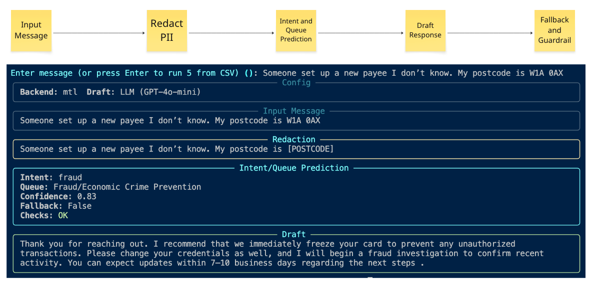
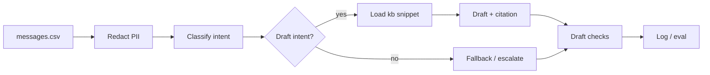
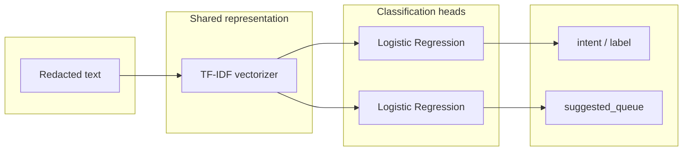

# Intelligent message routing with guardrails

Triage and route customer messages: PII redaction → intent classification → policy-grounded draft responses → guardrail checks.

---

## Quick start (steps in order)

| Step | What | How to run |
|------|------|------------|
| 1 | Install dependencies | `make install` (or `uv sync`) |
| 2 | *(Optional)* Train MTL model | `make train` (writes `models/mtl_model.joblib`) |
| 3 | *(Optional)* Enable LLM draft | Add `OPENAI_API_KEY` and `USE_LLM=1` to `.env`; draft then uses GPT-4o-mini (otherwise template). Redacted text only is sent. |
| 4 | Run the pipeline | `make run` (prompt for message or Enter for 5 from CSV; or `MSG="..."` for one message) |
| 5 | Run tests | `make test` |
| 6 | Run evaluation | `make eval` (optional: `TEST_RATIO=0.2` for 20% holdout; use after `make train TRAIN_RATIO=0.8`) |

Run `make` or `make help` to list all targets.

---

## Setup, run & commands

**Setup:** `make install`. Data under `assignment/data/`: `messages.csv`, `pii_patterns.yaml`, `kb/*.md`.

**Run:** `make run` or `uv run python -m app`. Without `MSG`, you get a prompt (Enter message, or Enter to run 5 from CSV). With `MSG="..."` or `uv run python -m app "message"` runs on that one message. Single-step: `make run-redact`, `make run-predict`, `make run-draft` (each takes one input via `MSG` or prompt; pretty panels when `rich` is installed).

| Command | Purpose |
|--------|--------|
| `make install` | Install dependencies. Run first. |
| `make train` | Train MTL. Optional: `TRAIN_RATIO=0.8` for holdout. |
| `make run` | Full pipeline. `MSG="..."` or prompt. |
| `make run-redact` | Redact only. `MSG="..."` or prompt. |
| `make run-predict` | Prediction only (intent, queue, confidence). `MSG="..."` or prompt. |
| `make run-draft` | Draft only. `MSG="..."` or prompt. |
| `make test` | Unit tests. |
| `make eval` | Classification + draft checks. Optional: `TEST_RATIO=0.2`. |

Holdout: `make train TRAIN_RATIO=0.8` then `make eval TEST_RATIO=0.2` (split stratified, `random_state=42`).

---

## What is implemented

- **PII redaction**: Implemented (YAML patterns, regex, unit tests).
- **Intent classification**: MTL in `app/mtl.py` (TF-IDF + two LogReg heads)
- **Draft**: ≥2 intents (card lost/stolen, fraud), template or LLM (GPT-4o-mini when `USE_LLM=1` + key); confidence threshold 0.7.
- **Guardrails**: Citation + PII-in-draft checks; wired into pipeline.
- **Evaluation**: Classification metrics, draft checks sample, redaction tests.
- **CLI**: Interactive run; single-step `redact` / `predict` / `draft`; rich progress/tables/panels

---

## System architecture

Pipeline: Ingress → **PII redaction** → intent classification → draft (supported intents) → guardrail checks → logging/eval. Redaction runs before any non-local or external call. Classification: MTL when `models/mtl_model.joblib` exists, else stub. Draft: template or LLM (GPT-4o-mini) when enabled; fallback to template on failure.

---

## Spec Driven Development

This project uses **OpenSpec** for spec-driven development: changes are described as proposals, specs, design, and tasks before implementation.

- **Benefits**: Clear scope and acceptance criteria; alignment between product, design, and code; fewer surprises at review time. Specs act as the single source of truth and a living manual.
- **Formalised workflow**: Follow the schema (e.g. proposal → specs per capability → design → tasks). Stick to the manual and instruction docs so artefacts stay consistent and auditable.
- **OpenSpec**: Change artefacts live under `openspec/changes/`. You can **modify** specs and **track** progress (e.g. `openspec status`, `openspec instructions`). Version control keeps a history of what was changed or decided and when.

**Current change (aligned with this codebase):** `openspec/changes/intelligent-message-routing-guardrails/` — **proposal** (why, what, capabilities), **specs** (pii-redaction, intent-classification, draft-response, evaluation-guardrails), **design** (decisions, risks, implementation notes), **tasks** (all completed). Each spec includes a short *Implementation (code sync)* line pointing at the implementing module so docs stay in sync with the code.

---

## Hybrid model: Multi-Task Learning (MTL) + LLM

**MTL structure (shared representation, two heads):**

| Component | Solves | Role |
|-----------|--------|------|
| **MTL** | Intent + queue; latency & cost; explainability; data local. | TF-IDF + 2 LogReg; inference inside the internal environment; no raw data out. |
| **LLM** | Workflow orchestrator. Draft text; policy + citations; flexible phrasing. | Draft only (redacted + intent); fallback; guardrail checks. |

**Flow:** Redact → Model (MTL) → Draft (kb → template or LLM) → Guardrails. Redaction gates all; MTL picks policy; guardrails on final draft.

**Benefits:** Fast MTL train; task tuning; local/cheap/secure; fallback cuts cost; accurate routing + cited responses.

---

## Draft and fallback logic

Draft is generated only for **supported intents** (e.g. card lost/stolen, suspected fraud). For other intents we return an escalation message and set `fallback=True`.

| Condition | Result |
|-----------|--------|
| Intent not in draft scope | Escalation message; `fallback=True`. |
| No kb snippet for intent | Escalation message; `fallback=True`. |
| Confidence &lt; 0.7 | Template draft; `fallback=True` (no LLM call). |
| LLM disabled / unavailable / error | Template draft + `[No-LLM fallback]`; `fallback=True`. |
| LLM returns text | Use LLM draft; `fallback=False`. |

When `fallback=True`, the pipeline uses the template (no LLM call), which **saves tokens and cost** (no per-request API usage).

After drafting, **guardrails** run on the output: citation check and PII-in-draft check. They do not change the draft text; the pipeline logs pass/fail (e.g. `checks=OK` or `FAIL:possible_pii_in_draft`). Low confidence or failed checks can drive escalation.

---

## Implemented vs future improvements

| Area | Implemented | Future |
|------|-------------|--------|
| **PII redaction** | YAML + regex, tests; before external call. | Rules-based metrics; more patterns. |
| **Intent classification** | MTL (TF-IDF + 2 LogReg); stub; holdout. | More intents; LLM few-shot; BERT tuning for semantic information. |
| **Draft** | ≥2 intents; template/LLM; 0.7, fallback. | More intents; internal LLM. |
| **Guardrails** | Citation + PII-in-draft; escalate. | Safety filter; grammar; thresholds; business rules/compliance. |
| **Evaluation** | Metrics; draft checks; redaction tests; holdout. | Recall curve; per-intent; fairness. |
| **CLI / run** | Interactive; panels. | API; batch. |
| **Ops / monitoring** | Logs, eval. | Dashboards; drift; alerting; retrain. |
| **Risk** | Redact first; no PII out; escalation. | Risk register; audit; data/model governance. |
| **Cost** | MTL cheap; LLM per-request; fallback saves tokens. | Alerts; quota; cost per queue; on-prem LLM. |
| **Latency** | MTL ms; LLM 100s ms; fixed order. | SLA; async; quantization. |