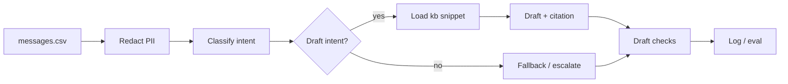
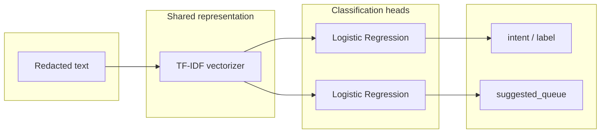

# Intelligent message routing with guardrails

---

## 1. Goal, features, and KPI

**Goal**  
Triage customer messages: redact PII → classify intent → policy-grounded draft with guardrails and fallbacks.

**Main features**

| Feature | What it does | KPI |
|--------|--------------|------------|
| **PII redaction** | Redact sensitive tokens before any external call (YAML patterns). | **Redaction recall**; privacy/compliance. |
| **Intent classification** | Route to queue (Fraud, Disputes, General, Credit); Multi-Task Learning (MTL). | **Precision** (e.g. fraud routing); **latency SLA**. |
| **Draft response** | Policy-grounded draft for ≥2 intents; template or LLM; confidence fallback. | **Draft quality**; citation; cost (fallback saves tokens). |
| **Guardrails** | Citation + PII-in-draft checks; escalate on low confidence or fail. | Safe automation; audit trail. |
| **Evaluation** | Classification metrics, holdout eval, redaction/draft tests. | **Accuracy**; redaction recall. |

---

## 2. App runnable example

*Content to be added.*

---

## 3.Solution design

**. Hybrid model: LLM + MTL**

| Component | Solves | Role |
|-----------|--------|------|
| **MTL** | Intent + queue; latency & cost; explainability; data local. | TF-IDF + 2 LogReg; Inference inside the interal environment; no raw data out. |
| **LLM** | Workflow orchestrator. Draft text; policy + citations; flexible phrasing. | Draft only (redacted + intent); fallback; guardrails checks. |

Benefits: fast MTL train; task tuning; local/cheap/secure; fallback cuts cost; routing + cited replies.

**. Workflow integration**  
Redact → Model (MTL) → Draft (kb → template or LLM) → Guardrails (citation, PII-in-draft; escalate). Redaction gates all; MTL picks policy; guardrails on final draft.

**. Spec driven development**  
Proposal → specs → design → tasks; single source of truth; auditable; versioned.

---

## 4. Architecture 

**.System architecture (pipeline)**

**.Hybrid model: MTL structure (shared representation, two heads)**

---

## 5. Evaluation, explainability & monitoring

| Area | What we do / key points |
|------|-------------------------|
| **Evaluation** | Classification accuracy (optional holdout); redaction unit tests + recall; draft guardrail pass rate and fallback rate on sample. |
| **Explainability** | MTL = features/weights, auditable; LLM = citations + guardrails; escalation on low confidence. |
| **Monitoring** | Guardrail fail rate, fallback rate, latency; accuracy on labelled sample; **drift detection** (prediction vs ground truth over time → alert, retrain or investigate). |
| **Testing safely pre‑production** | Shadow mode (no customer send); holdout + guardrails pass before go‑live; human review sample; rollout with template/high-confidence first|

---

## 6. Implemented vs future improvements

| Area | Implemented | Future |
|------|-------------|--------|
| **PII redaction** | YAML + regex, tests; before external call. | Rules-based metrics; more patterns. |
| **Intent classification** | MTL (TF-IDF + 2 LogReg); stub; holdout. | More intents; LLM few-shot; Bert Tuning for semantic information. |
| **Draft** | ≥2 intents; template/LLM; 0.7, fallback. | More intents; Internal LLM. |
| **Guardrails** | Citation + PII-in-draft; escalate. | Safety filter; grammar; thresholds; Business rules/compliance. |
| **Evaluation** | Metrics; draft checks; redaction tests; holdout. | Recall curve; per-intent; Fairness. |
| **CLI / run** | Interactive; panels | API; batch. |
| **Ops / monitoring** | Logs, eval. | Dashboards; drift; alerting; retrain. |
| **Risk** | Redact first; no PII out; escalation. | Risk register; audit; data/model governance |
| **Cost** | MTL cheap; LLM per-request; fallback saves tokens. | Alerts; quota; cost per queue; on-prem LLM |
| **Latency** | MTL ms; LLM 100s ms; fixed order. | SLA; async; quantization. |
